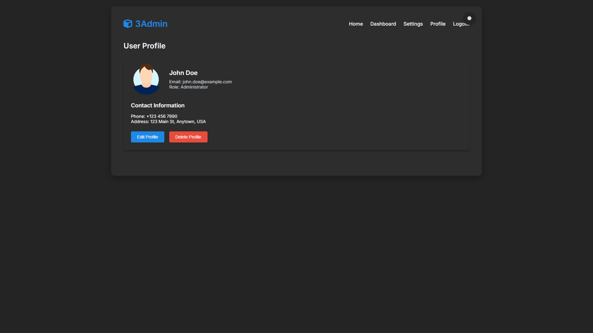

# Admin3 Dashboard - Documentation





## Table of Contents
1. [Overview](#overview)
2. [Features](#features)
3. [Installation](#installation)
4. [Usage](#usage)
5. [Customization](#customization)
6. [Theme System](#theme-system)
7. [Components](#components)
8. [API Integration](#api-integration)
9. [Deployment](#deployment)
10. [Contributing](#contributing)
11. [License](#license)

## Overview

Admin3 is a modern, responsive admin dashboard template developed by **LeonXlab**. Designed for developers and businesses, it provides a clean, professional interface for building admin panels, CMS systems, and back-office applications.

**Key Benefits:**
- 🚀 Production-ready template
- 🎨 Customizable design system
- 🌓 Built-in dark/light mode
- 📱 Fully responsive layout
- ⚡ Optimized performance

## Features

### Core Features
- **Modern UI/UX Design**
  - Clean, minimalist interface
  - Responsive layout (desktop, tablet, mobile)
  - Accessibility compliant (WCAG 2.1)

- **Theme System**
  - Light/dark mode toggle
  - System preference detection
  - Persistent theme settings

- **Pre-built Pages**
  - Dashboard
  - User management
  - Analytics
  - Settings
  - Login/Register

### Technical Features
- **Frontend Architecture**
  - Modular component structure
  - CSS variables for theming
  - Vanilla JavaScript (no framework dependency)
  - Chart.js integration

- **Performance**
  - Optimized asset loading
  - Minimal dependencies
  - Efficient DOM operations

### New Features
- **Scouts Section**
  - Display scouts in a grid layout with rectangular cards.
  - Each scout card contains details about the scout.

- **User Profile Page**
  - Separate page for user profile with detailed information.
  - Includes profile picture, contact information, and action buttons.

## Installation

### Prerequisites
- Node.js (v14+ recommended)
- npm/yarn
- Modern browser (Chrome, Firefox, Edge, Safari)

### Installation Steps

1. **Clone the repository**
   ```bash
   git clone https://github.com/leonxlab/admin3-dashboard.git
   cd admin3-dashboard
   ```

2. **Install dependencies**
   ```bash
   npm install
   # or
   yarn install
   ```

3. **Development server**
   ```bash
   npm run dev
   # or
   yarn dev
   ```

4. **Production build**
   ```bash
   npm run build
   # or
   yarn build
   ```

## Usage

### Basic Structure
```
admin3-dashboard/
├── assets/          # Static assets
├── css/            # Stylesheets
├── js/             # JavaScript modules
├── pages/          # Application pages
├── index.html      # Main entry point
└── README.md       # Documentation
```

### Starting the Dashboard

1. After installation, open `index.html` in your browser
2. Default login credentials (for demo):
   ```
   Email: admin@example.com
   Password: admin123
   ```

### Navigation
- **Sidebar**: Main navigation menu
- **Topbar**: Quick actions and user menu
- **Breadcrumbs**: Contextual navigation

## Customization

### Theme Colors
Modify CSS variables in `css/theme.css`:
```css
:root {
  --primary-color: #3498db;
  --secondary-color: #2ecc71;
  --danger-color: #e74c3c;
  /* ... */
}
```

### Layout Configuration
Edit `js/config.js`:
```javascript
const config = {
  sidebar: {
    collapsedWidth: '70px',
    expandedWidth: '250px'
  },
  theme: {
    default: 'system' // 'light' | 'dark' | 'system'
  }
};
```

## Theme System

### How it Works
1. Checks for saved user preference in localStorage
2. Falls back to system preference
3. Defaults to light theme

### API
```javascript
// Get current theme
const currentTheme = document.documentElement.getAttribute('data-theme');

// Toggle theme
document.getElementById('themeToggle').click();

// Listen for theme changes
document.addEventListener('themeChanged', (e) => {
  console.log('Theme changed to:', e.detail.theme);
});
```

## Components

### Available Components
1. **Cards**
   - Stat cards
   - Profile cards
   - Graph cards

2. **Charts**
   - Line charts
   - Bar charts
   - Pie charts

3. **Forms**
   - Input fields
   - Select dropdowns
   - Checkboxes/radios

4. **Tables**
   - Sortable columns
   - Pagination
   - Row selection

### Component Usage
Example card implementation:
```html
<div class="stat-card">
  <div class="stat-header">
    <span class="stat-title">Total Users</span>
    <div class="stat-icon">
      <i class="fas fa-users"></i>
    </div>
  </div>
  <div class="stat-value">1,024</div>
  <div class="stat-trend trend-up">
    <i class="fas fa-arrow-up"></i>
    <span>12.5% increase</span>
  </div>
</div>
```

## API Integration

### Authentication
Example login implementation:
```javascript
async function login(email, password) {
  const response = await fetch('/api/auth/login', {
    method: 'POST',
    headers: {
      'Content-Type': 'application/json'
    },
    body: JSON.stringify({ email, password })
  });
  
  if (!response.ok) throw new Error('Login failed');
  return response.json();
}
```

### Data Fetching
Example dashboard data:
```javascript
async function loadDashboardData() {
  const [users, sales, activities] = await Promise.all([
    fetch('/api/users'),
    fetch('/api/sales'),
    fetch('/api/activities')
  ]);
  
  return {
    users: await users.json(),
    sales: await sales.json(),
    activities: await activities.json()
  };
}
```

## Deployment

### Static Hosting
1. Build the project:
   ```bash
   npm run build
   ```

2. Deploy the `dist/` folder to:
   - Netlify
   - Vercel
   - AWS S3
   - GitHub Pages

### Docker Deployment
1. Build the Docker image:
   ```bash
   docker build -t admin3-dashboard .
   ```

2. Run the container:
   ```bash
   docker run -p 8080:80 admin3-dashboard
   ```

## Contributing

We welcome contributions! Please follow these steps:

1. Fork the repository
2. Create a feature branch (`git checkout -b feature/your-feature`)
3. Commit your changes (`git commit -m 'Add some feature'`)
4. Push to the branch (`git push origin feature/your-feature`)
5. Open a Pull Request

### Coding Standards
- Follow existing code style
- Write meaningful commit messages
- Include documentation for new features
- Test your changes thoroughly

---

**LeonXlab**  
[GitHub](https://github.com/leonxlab) | [Contact](mailto:leonxlab@icloud.com)
